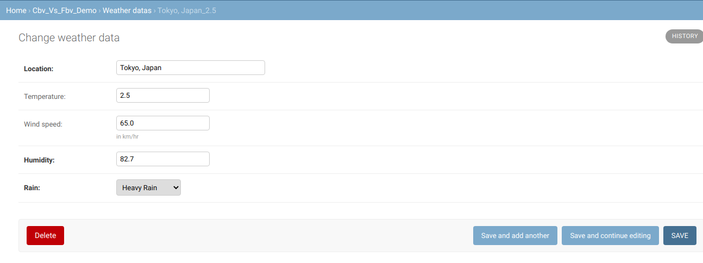
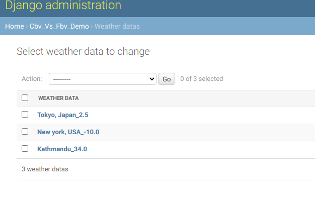

## We have used:
- Python 3.6+
- django 3.0+

## Assumption of audience
It is assumed that you(the audience) have a moderate understanding of django and python and you can create models and view.

## Description

When programming in django we come across a topic of Class Based View(CBV) and Function Based View(FBV). In this article we will discuss about how to use them and which one to use in what scenerio. The point of this article is to give Django developer a scenerio when to use FBV over CBV and vice versa.

### Table of content
- [Models Creation:](#model-creation)
- [Function Based view](#fbv)
  - [List view](#fbv-list-view) 
  - [Detail View](#fbv-detail-view)
- [Class based view](#cbv)
  - [List view](#cbv-list-view)
  - [Detail view](#cbv-detail-view)

- [Comparision of CBV and FBV](#comparision)
- [Conclusion](#conclusion) 

### Models Creation
To explain this concept lets create a model in django. In this article we will create a simple weather data storage system. 

    # models.py
    from django.db import models

    # Create your models here.
    class WeatherData(models.Model):
        location = models.CharField(max_length=30)
        temperature = models.FloatField(blank=True, null=True)
        wind_speed = models.FloatField(blank=True, null=True, help_text="in km/hr")  # in km/hr
        humidity = models.FloatField(default=0)  # form 0-100%
        rain = models.CharField(max_length=2, choices=(
            ('NR', "No Rain"),
            ('LR', 'Less/Few Rain'),
            ('MR', 'Moderate Rain'),
            ('HR', 'Heavy Rain'),
        ))
        created_date = models.DateTimeField(auto_now=True)

        def __str__(self):
            return "{0}_{1}".format(self.location, self.temperature)



Lets add some data in the models

List of images added

### Function Based View(FBV)
In the begining of django development there was only function based view, later developers started noticing some feature were redundent and tried to extend view using various generic view. However, it was consistently hard to extend function based view. Therefore, later they introduced class based views. This example has 2 function based views 2 for listing data and another for displaying individual item. 

#### FBV List View
We can list item in function based view as shown below.
Since this is a list view it is always good practice to paginate data and present them in small chunks with links to move to new data. 

Here is our views.py with function FBV_list_veiw

def FBV_list_view(request):
    # you need to order it before pagination else paginator throws warning
    data = WeatherData.objects.all().order_by('-created_date')
    page = request.GET.get('page', 1)

    paginator = Paginator(data, 5)
    try:
        weather_data = paginator.page(page)
    except PageNotAnInteger:
        weather_data = paginator.page(1)
    except EmptyPage:
        weather_data = paginator.page(paginator.num_pages)

    return render(request, 'cbv_vs_fbv_demo/list.html', {
        'weather_data': weather_data
    })



This view can be rendered like this in urls.py


from django.urls import path, include
from .views import FBV_list_view

urlpatterns = [
    path('', FBV_list_view, name="fbv_list_view"),
]


The templates looks like this in list.html


<table>
  <thead>
    <tr>
      <th>Location</th>
      <th>Temperature</th>
      <th>Wind Speed</th>
      <th>Humidity</th>
      <th>Rain</th>
    </tr>
  </thead>
  <tbody>
    
      <tr>
        <td>{{ data.location }}</td>
        <td>{{ data.temperature }}</td>
        <td>{{ data.wind_speed }}</td>
        <td>{{ data.humidity }}</td>
        <td>{{ data.rain }}</td>
      </tr>
    
  </tbody>
</table>


  <ul class="pagination">
    
      <li><a href="?page={{ weather_data.previous_page_number }}">&laquo;</a></li>
    
      <li class="disabled">&laquo;</li>
    
    
      
        <li class="active">{{ i }} (current)</li>
      
        <li><a href="?page={{ i }}">{{ i }}</a></li>
      
    
    
      <li><a href="?page={{ weather_data.next_page_number }}">&raquo;</a></li>
    
      <li class="disabled">&raquo;</li>
    
  </ul>




#### FBV Detail View
For detail view we just pull the data based on id or slug. Here in this tutorial we are going to use it using id.
Detail view function looks like this.


def FBV_detail_view(request, id):
    data = WeatherData.objects.get(id=id)

    return render(request, 'cbv_vs_fbv_demo/detail.html', {
        'data': data
    })


We will add path like this in urls.py


#... 
urlpatterns = [
    #...
    path('detail/<int:id>/', FBV_detail_view, name="FBV_detail_view"),
]



### Class Based View(CBV)
For class based view we will use generic classes and render the same thing. Class based view makes it much easier to write our code in less amount of time. 

#### CBV List View

Following is the code for doing the same thing as list view did in function based view. 
In veiws.py we will make our view class.


#... others as it is 
from django.views.generic.list import ListView
from django.views.generic.detail import DetailView

class CBV_list_view(ListView):
    """
    Class based view for listing data
    """
    model = WeatherData
    paginate_by = 5
    context_object_name = "weather_data"
    template_name = "cbv_vs_fbv_demo/list_cbv.html"



We can link this in url using following code snippet


#....others as it is
path('list/', CBV_list_view.as_view(), name="cbv_list_view"),


The main point to notice here is .as_view() method call. In function based view we call functions directly but in class based view we call as_view() method. We can also say urls simply have methods call in them.

#### CBV Detail View
Detail view has following code in it



class CBV_detail_view(DetailView):
    model = WeatherData
    context_object_name = "data"
    template_name = "cbv_vs_fbv_demo/detail.html"



urls looks like this


#....others as it is
path('cbv_detail/<int:pk>/', CBV_detail_view.as_view(), name="CBV_detail_view"),


### Comparision of CBV and FBV 
In the begining of the django there was only function based views later they introduced the concept of class based view to simply some repetative task. Lets compare advantages and disadvantages in CBV and FBV

Advantages of CBV:
1. The code becomes concise and saves time.
2. We can use already built in generic views, this makes it easy to extend the class
3. We use separate get and post method to handle various request.
   
Disadvantages of CBV:
1. It hides a lot of implementation detail which make it harder to read and maintain.
2. It difficult for beginners to wrap head around in the first place. Once they understand the flow it becomes easier.
3. For using decorators we need to import separte method called method_decorator(syntax @method_decorator(...)) 
   

Advantages of FBV:
1. The code is more explicit and make it easy to read and understand.
2. Easy to use decorators (like login_required and so on)
3. Easy to understand for beginners
   
Disadvantages of FBV:
1. It uses if else statement for various request like GET and POST
2. It difficult to extend commonly used functionality for instance pagination. 
   

### Conclusion
### When should we use which.
In my opinion both FBV and CBV completes the job. I would recommend using CBV in most of the cases as it is simple to extend and add functionality. However, if we need to write code that needs explicit explanation(like implementing an complex algorithm) FBV might be right approach. Also task like serving pdf files, or other resources can take FBV. 

I hope you like this article please feel free to contact me if you have any question.